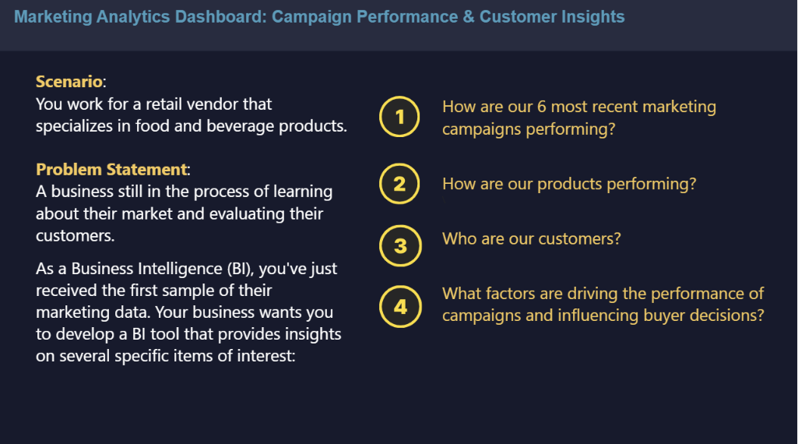
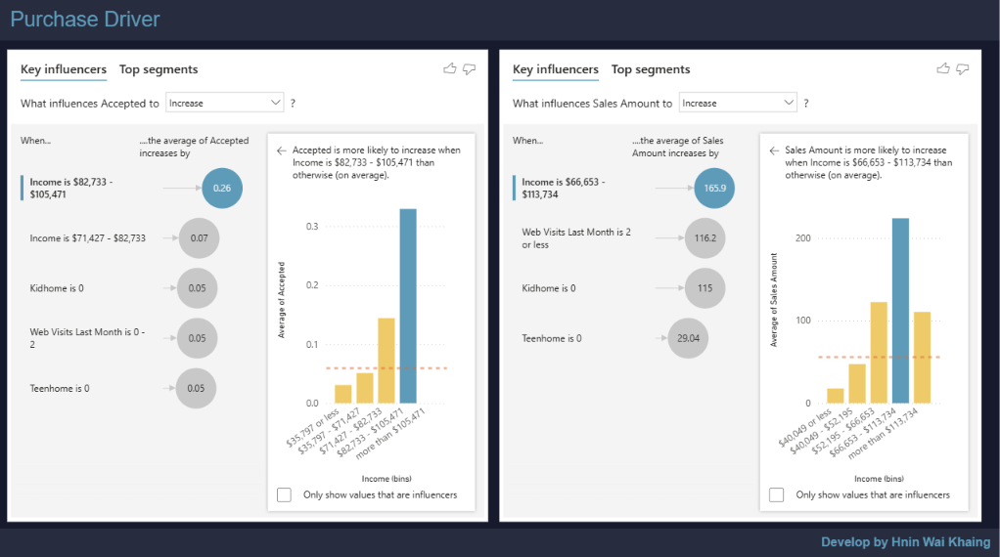

# Marketing Analytics Dashboard: Campaign Performance & Customer Insights

## Project Overview

This project is a **Power BI Marketing Analytics solution** for a retail
food and beverage business. It analyzes customer demographics, product
spending, marketing campaign responses, and purchasing channels to
provide a consolidated view of marketing performance and customer
behavior.

The project connects **business questions → analysis → insights →
business recommendations**.

## Business Problem

The business has customer and marketing data but lacks a consolidated
analytical view for understanding campaign effectiveness and customer
purchasing behavior. Management needs to identify strong and weak
campaigns, leading product categories, core customer segments, preferred
purchase channels, and factors associated with campaign response and
spending.

## Business Questions

1.  How are the six analyzed marketing campaigns performing?
2.  How are the product categories performing?
3.  Who are our customers?
4.  What factors are associated with campaign performance and buyer
    decisions?

## Project Objectives

-   Evaluate the six analyzed marketing campaigns.
-   Identify stronger and weaker campaign performance.
-   Analyze customer spending across product categories.
-   Understand customer demographic and socioeconomic characteristics.
-   Compare purchasing behavior across Store, Web, Catalog, and Deals.
-   Explore factors associated with campaign acceptance and customer
    spending.
-   Translate findings into actionable business recommendations.

## Dataset Overview

The analysis uses approximately **2.24K customer records**.

**Customer demographics:** Year of Birth, Education, Marital Status,
Income, Children at Home, Teenagers at Home, Country.

**Product spending:** Wine, Fruits, Meat Products, Fish Products, Sweet
Products, and Baked Products.

**Purchase channels:** Web, Catalog, Store, and Deals.

**Campaign information:** Five historical campaign acceptance fields
plus the latest campaign response used as the sixth analyzed campaign.

**Behavioral information:** Recency, web visits, complaints, and related
customer activity.

## Analytical Workflow

``` text
Business Problem
      ↓
Business Questions
      ↓
Data Understanding & Preparation
      ↓
KPI / Measure Development
      ↓
Power BI Dashboard
      ↓
Insights
      ↓
Business Recommendations
```

Key activities included data review and preparation, customer age-group
preparation, campaign-response comparison, product-spending and channel
analysis, KPI development, and Power BI Key Influencers analysis.

## Dashboard Pages

### Campaign Performance Analysis

Evaluates campaign response, customer spending, product mix, and
purchase channels to identify stronger and weaker marketing performance.

### Customer Composition Analysis

Profiles customers using total customers, average income, average age,
education, marital status, household composition, and age-based product
preferences.

### Purchase Driver Analysis

Uses **Power BI Key Influencers** to explore customer characteristics
associated with campaign acceptance and customer spending.

### Insight Explanation

Consolidates campaign, product, customer, channel, and purchase-driver
findings into an executive-level summary.

### Business Recommendations

Translates analytical findings into practical actions for campaign,
product, customer, and channel strategy.

## Key Insights

-   **Campaign 6** showed the strongest campaign response/purchase
    performance, while **Campaign 2** performed comparatively weakly.
-   **Wine** was the dominant product category by customer spending,
    with Meat another major spending category.
-   The customer base was largely **middle-aged, relatively
    well-educated, and married**.
-   **In-store purchasing** was the strongest purchase channel.
-   **Income** emerged as an important observed factor associated with
    campaign acceptance and customer spending.
-   Product preferences varied across age groups, indicating
    opportunities for targeted product promotions.

> The Key Influencers findings represent associations in the analyzed
> data and should not be interpreted as proof of causation.

## Business Recommendations

### Optimize Campaign Strategy

Use **Campaign 6 as a benchmark** for future campaign evaluation and
investigate the weaker performance of Campaign 2 before repeating
similar approaches.

### Strengthen Product Strategy

Prioritize **Wine in high-value promotions** and test cross-selling or
bundled offers with complementary product categories.

### Personalize Customer Targeting

Use **income, age, and customer characteristics** to develop more
relevant segment-specific campaigns.

### Improve Channel Performance

Maintain strong **in-store promotional activity** while testing targeted
strategies to improve Web and Catalog engagement.

### Measure Continuously

Evaluate future campaigns using consistent campaign-response,
customer-spending, product, and channel KPIs before scaling successful
strategies.

## Project Outcome

Developed an interactive Power BI decision-support solution that
transforms raw marketing and customer data into insights for **campaign
optimization, customer segmentation, product promotion, cross-selling,
and channel strategy**.

The project demonstrates an end-to-end BI workflow from **business
problem framing and data preparation through dashboard development,
insight generation, and business recommendations**.

## Tools & Skills

  -----------------------------------------------------------------------
  Area                                Tools / Skills
  ----------------------------------- -----------------------------------
  Business Intelligence               Power BI

  Data Preparation                    Power Query

  Calculations                        DAX

  Analysis                            Marketing Analytics, Campaign
                                      Analysis, Customer Segmentation

  Advanced Analysis                   Power BI Key Influencers

  Visualization                       KPI Design, Dashboard Development,
                                      Data Storytelling

  Business Skills                     Problem Framing, Insight
                                      Generation, Recommendations
  -----------------------------------------------------------------------

## Repository Structure

``` text
marketing-analytics-dashboard/
├── data/
│   └── Market Research Data.xlsx
├── power_bi/
│   └── Marketing_Analytics_Dashboard.pbix
├── images/
│   ├── project_informaion.png
|   ├── campaign_performance.png
│   ├── customer_composition.png
│   ├── purchase_driver.png
│   ├── insights.png
│   └── recommendations.png
└── README.md
```


## Dashboard Preview


``` markdown






```

## Skills Demonstrated

`Power BI` `Power Query` `DAX` `Data Cleaning` `KPI Development`
`Data Visualization` `Marketing Analytics` `Campaign Analysis`
`Customer Segmentation` `Key Influencers` `Business Intelligence`
`Data Storytelling`


